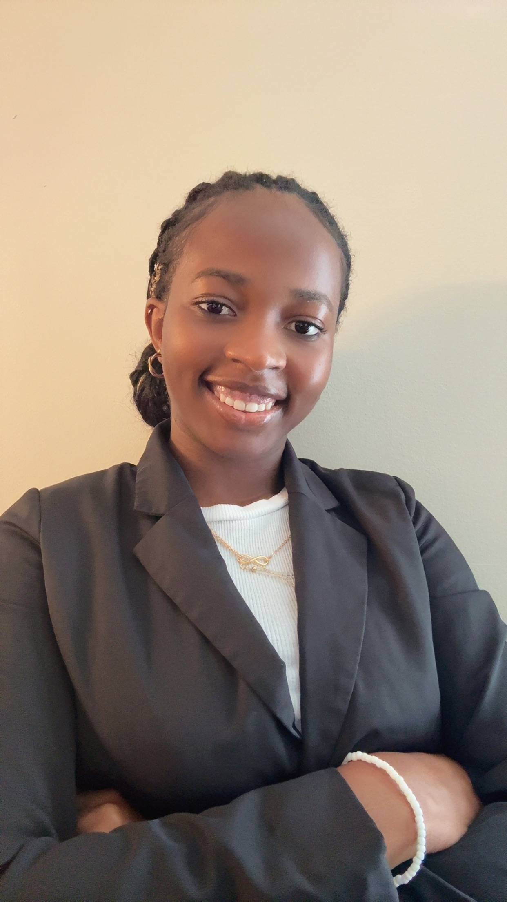
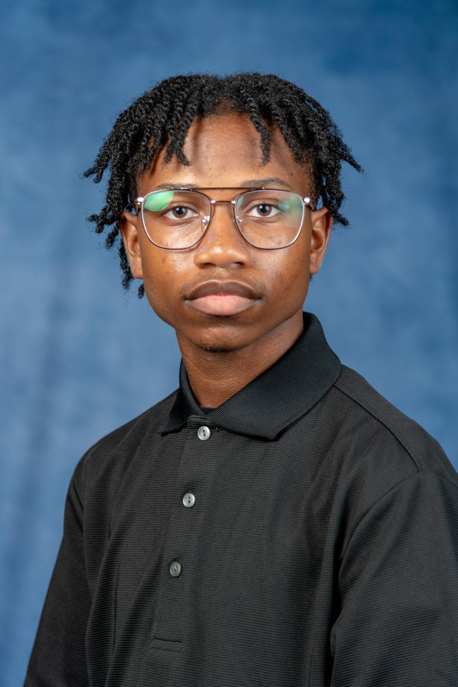
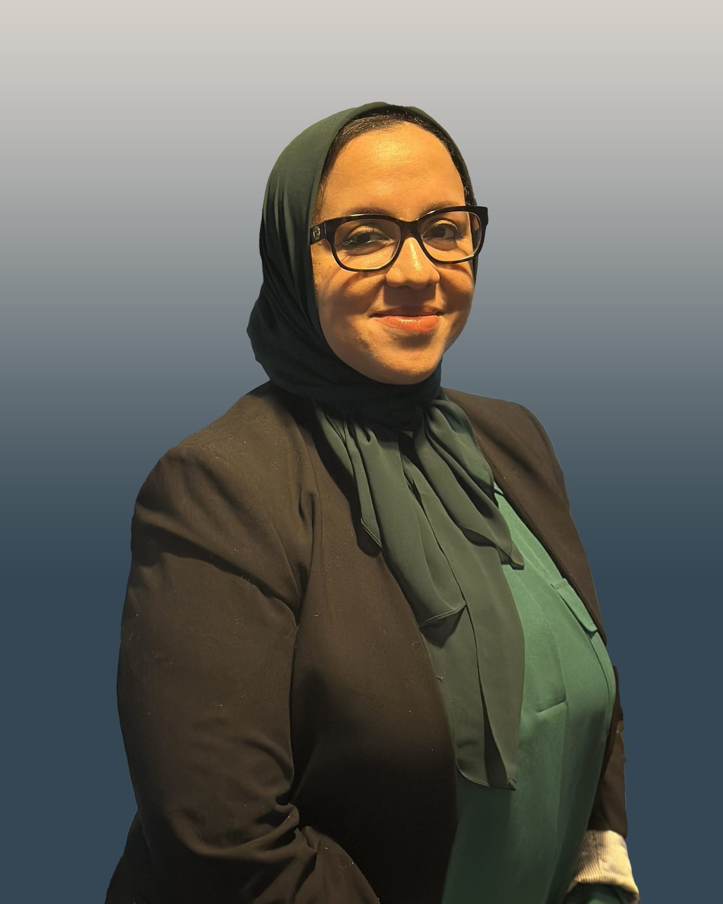
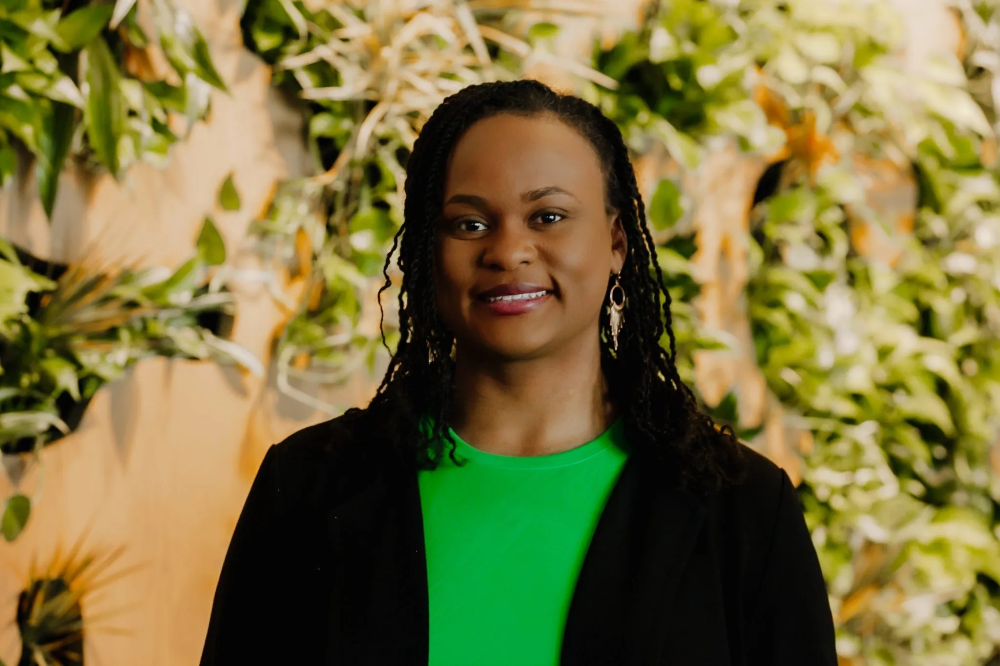

# MS-CC_2025
## Meet the Team: Student Mentees

Juliet Alozie

My name is Juliet Oluchukwu Alozie. I am a dedicated Junior at Fisk University pursuing a Bachelor of Science in Biology with a minor in Business. I am also a recipient of multiple honors, including the Fisk Executive Leadership Program scholarship, the Quillin Hastings Award, and W.E.B. Du Bois Honors recognition. Alongside my academic work, I am committed to developing strong leadership skills.

My professional experiences range from providing compassionate care to seniors and individuals with special needs to enhancing historical archives through photo editing and metadata organization. These roles have deepened my compassion and attention to detail traits, which I believe are essential for my future in healthcare as a nurse, where I can continue to serve my community with empathy and professionalism. Whether in a clinical setting or behind the scenes, I strive to make a meaningful impact by combining my knowledge of biology with genuine care for people.

Justin Freeman

## Meet the Team: Mentors

Asmah Muallem, Ph.D.

Asmah Muallem, Ph.D. joined Meharry School of Applied Computational Sciences in January 2025 as assistant professor, computer science and data science. Dr. Muallem is passionate about applying AI/ML technologies to find solutions that address the evolving landscape of cybersecurity, especially the complex challenges of cyber threats in healthcare. She is also an enthusiastic participant in the multi-disciplinary collaborations on the use of AI/ML technologies for the good of society. 

Her experience includes research and teaching assistant roles along with several years of experience in the tech sector, most recently as a machine learning engineer leveraging machine learning, data science, software engineering, cybersecurity and research.  

Roles mentoring students in many machine learning and data science initiatives highlight her academic experience. As a researcher she has published work and contributed to several machine learning projects aimed at developing techniques for cybersecurity and big data. 

Her career also includes twenty years of progressive tech roles, including stints as programmer, computer systems analyst, QA automation analyst, mobile developer before her most recent machine learning engineer position. 

Loni Taylor, MS, PMP, CETL
